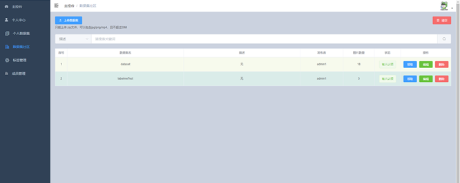
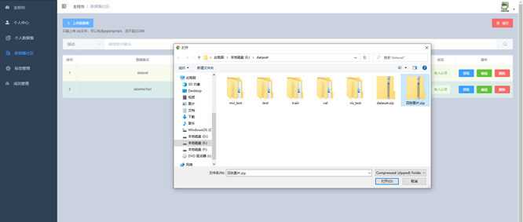
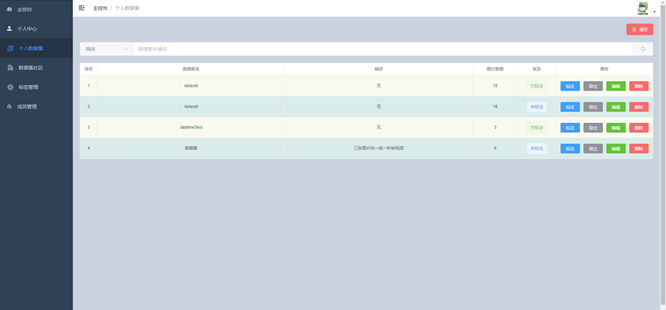
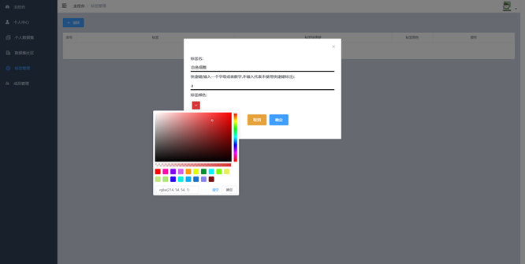
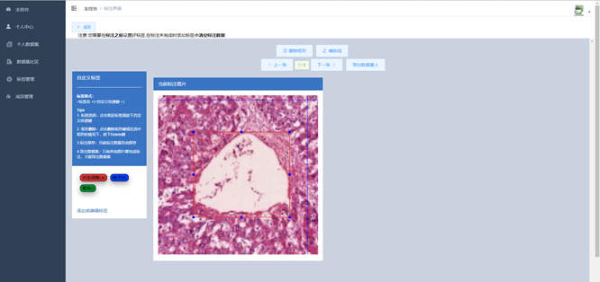

# Image Annotation System

整体系统包含以下功能：

1.  :star:**用户注册**：需要提供用户名、密码、邮箱这些必要信息，并进行基本的验证
2.  :star:**用户登录**：通过邮箱或用户名登录
3.  :star:**用户信息修改**：登录后可以修改用户密码
4.  :star:**用户管理**：可以查看别的用户的信息
5.  :star:批量**图片**、**视频上传**功能，并且能够将上传的视频抽帧转换为多张图片作为一个图像数据集
6.  :star:用户可以**领取任务**进行数据标注
7.  :star:标注结果支持**导出多种数据集**的格式（PASCAL VOC、COCO）


## Start

- 数据库设定
    - 新建数据库：myLabelDB
    - CREATE DATABASE `myLabelDB` CHARACTER SET utf8mb4 ;

- 先安装一下依赖

```
cd ./backend
pip install -r requirements.txt
```

- 进入到 backend 文件夹中(manage.py 所在目录)
- 运行后端服务器

```
cd ./backend
python manage.py runserver
```

- 新建终端，进入到 frontend 文件夹中
- 在命令行中输入以下命令，会打开前端页面

```
cd ./frontend
npm install
npm run serve
```

## Examples

|        Function        |                           example                            |
| :--------------------: | :----------------------------------------------------------: |
|     查看公共数据集     |  |
|       发布数据集       |  |
| 领取到个人数据集中查看 |  |
|       自定义标签       |  |
|     标注数据集图片     |  |


## License

MIT

## Reference

[文本标注系统](https://github.com/Syngou/annotate-system)

[画矩形的项目](https://github.com/Tz-wang/vue-annotation)

